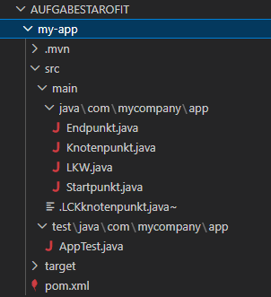
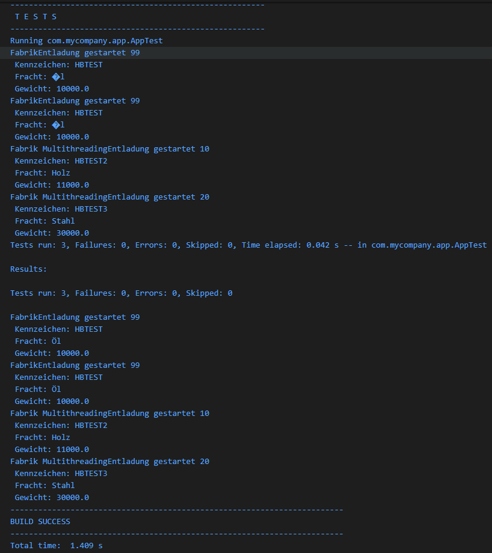

# Programmieraufgabe: Threadsichere Schnittstellenimplementierung


## 1. Technische Voraussetzungen
* **Java Version:** JDK 21 
* **Build-Management:** Maven 3.9+
* **Test-Framework:** JUnit 5

---

## 2. Architektur & Komponentenübersicht



Das System trennt Logik und Datenhaltung strikt und setzt auf lose Kopplung über ein zentrales Interface.

| Klasse / Datei | Fachliche Rolle |
| :--- | :--- |
| **`LKW.java`** | Datenobjekt (Record) |
| **`Startpunkt.java`** | Haupteinstiegspunkt |
| **`Knotenpunkt.java`** | Schnittstelle (Interface) |
| **`Endpunkt.java`** | Service-Implementierung |
| **`AppTest.java`** | JUnit 5 Integrationstest |


---

## 3. Quellcode

### 3.1 Das Datenmodell (`LKW.java`)
```java
package com.mycompany.app;

// unveränderlicher Record
public record LKW(int transportnummer, String fracht, String kennzeichen, double gewicht) {
}

```

### 3.2 Haupteinstiegspunkt (`Startpunkt.java`)
```java
package com.mycompany.app;

public final class Startpunkt {

    public static void main(String[] args) {

        LKW mehllaster = new LKW(1, 
                                 "Mehl", 
                                 "HBKX440", 
                                 20000.0);

        LKW milchlaster = new LKW(2, 
                                  "Milch", 
                                  "HBKX441", 
                                  25000.0);
                                  

        System.out.println("1 fährt los: " + mehllaster.fracht());
        System.out.println("2 fährt los: " + milchlaster.fracht());

        Knotenpunkt fabrik = new Endpunkt("Fabrik ");

        fabrik.lkwEntladung(mehllaster);
        fabrik.lkwEntladung(milchlaster);

    }
}

```

### 3.3 Die Schnittstelle (`Knotenpunkt.java`)
```java
package com.mycompany.app;
public interface Knotenpunkt {

    void lkwEntladung(LKW lkw);
}


```

### 3.4 Die threadsichere Implementierung (`Endpunkt.java`)
```java
package com.mycompany.app;
import java.util.Map;
import java.util.concurrent.ConcurrentHashMap;

public class Endpunkt implements Knotenpunkt {

    private final String ortsname;
    private final Map<Integer, LKW> logbuch = new ConcurrentHashMap<>();

    public Endpunkt(String ortsname) {
        this.ortsname = ortsname;

    }

    @Override
    public void lkwEntladung(LKW lkw) {

        logbuch.put(lkw.transportnummer(), lkw);
        System.out.println(ortsname 
        + "Entladung gestartet " + lkw.transportnummer() 
        + "\n" + " Kennzeichen: " + lkw.kennzeichen() 
        + "\n" + " Fracht: " + lkw.fracht() 
        + "\n" + " Gewicht: " + lkw.gewicht());

    }

    public LKW getLog(int transportnummer) {
        return this.logbuch.get(transportnummer);
    }
        
}

```

### 3.5 Validierung & Thread-Safety-Beweis (`AppTest.java`)
```java

package com.mycompany.app;

import java.util.concurrent.CompletableFuture;

import static org.junit.jupiter.api.Assertions.assertEquals;
import static org.junit.jupiter.api.Assertions.assertNotNull;
import static org.junit.jupiter.api.Assertions.assertTrue;
import org.junit.jupiter.api.Test;

public class AppTest {

    // Einfacher Standard-Test
    @Test
    public void shouldAnswerWithTrue() {
        assertTrue(true);

        LKW testLkw = new LKW(99, "Öl", "HBTEST", 10000.0);
        Endpunkt testEndpunkt = new Endpunkt("Fabrik");

        assertNotNull(testLkw, "LKW-Objekt sollte nicht null sein");

        assertEquals(99, testLkw.transportnummer(), "Transportnummer stimmt nicht");
        assertEquals("Öl", testLkw.fracht(), "Die Fracht stimmt nicht");
        assertEquals("HBTEST", testLkw.kennzeichen(), "Das Kennzeichen stimmt nicht");
        assertEquals(10000.0, testLkw.gewicht(), "Gewicht stimmt nicht");

        testEndpunkt.lkwEntladung(testLkw);
    }

    // Testen ob das Logbuch im RAM die Daten behält
    @Test
    public void entladungsLog() {
        LKW tesLkw = new LKW(99, "Öl", "HBTEST", 10000.0);
        Endpunkt testEndpunkt = new Endpunkt("Fabrik");

        testEndpunkt.lkwEntladung(tesLkw);
        
        LKW entladenerLkw = testEndpunkt.getLog(99);
        
        assertNotNull(entladenerLkw, "LKW wurde nicht im Logbuch des Endpunkts gespeichert");
        assertEquals("HBTEST", entladenerLkw.kennzeichen(), "Das Kennzeichen im Logbuch stimmt nicht überein");
        assertEquals("Öl", entladenerLkw.fracht(), "Die Fracht im Logbuch stimmt nicht überein");
    }

    // Der Thread-Safety-Beweis
    @Test
    public void testingThreatSafety() throws Exception {
        
        Endpunkt testEndpunkt = new Endpunkt("Fabrik Multithreading");

        LKW lkw1 = new LKW(10, "Holz", "HBTEST2", 11000.0);
        LKW lkw2 = new LKW(20, "Stahl", "HBTEST3", 30000.0);
     
        CompletableFuture<Void> thread1 = CompletableFuture.runAsync(() -> {
            testEndpunkt.lkwEntladung(lkw1);
        });

        CompletableFuture<Void> thread2 = CompletableFuture.runAsync(() -> {
            testEndpunkt.lkwEntladung(lkw2);
        });
    
        CompletableFuture.allOf(thread1, thread2).join();
 
        assertNotNull(testEndpunkt.getLog(10), "LKW 1 ging verloren");
        assertNotNull(testEndpunkt.getLog(20), "LKW 2 ging verloren");
    }
} 


```

## 4 Testergebnis
```java
PS G:\DEV\JAVA\AUFGABESTAROFIT\my-app> mvn clean test           
[INFO] Scanning for projects...
[INFO] 
[INFO] ----------------------< com.mycompany.app:my-app >----------------------
[INFO] Building my-app 1.0-SNAPSHOT
[INFO]   from pom.xml
[INFO] --------------------------------[ jar ]---------------------------------
Downloading from central: https://repo.maven.apache.org/maven2/org/apache/maven/plugins/maven-clean-plugin/3.4.0/maven-clean-plugin-3.4.0.pom
Downloaded from central: https://repo.maven.apache.org/maven2/org/apache/maven/plugins/maven-clean-plugin/3.4.0/maven-clean-plugin-3.4.0.pom (5.5 kB at 15 kB/s)
Downloading from central: https://repo.maven.apache.org/maven2/org/apache/maven/plugins/maven-plugins/42/maven-plugins-42.pom
Downloaded from central: https://repo.maven.apache.org/maven2/org/apache/maven/plugins/maven-plugins/42/maven-plugins-42.pom (7.7 kB at 175 kB/s)
[INFO] 
[INFO] --- clean:3.4.0:clean (default-clean) @ my-app ---
Downloading from central: https://repo.maven.apache.org/maven2/org/codehaus/plexus/plexus-utils/4.0.1/plexus-utils-4.0.1.pom
Downloaded from central: https://repo.maven.apache.org/maven2/org/codehaus/plexus/plexus-utils/4.0.1/plexus-utils-4.0.1.pom (7.8 kB at 167 kB/s)
Downloading from central: https://repo.maven.apache.org/maven2/org/codehaus/plexus/plexus-utils/4.0.1/plexus-utils-4.0.1.jar
Downloaded from central: https://repo.maven.apache.org/maven2/org/codehaus/plexus/plexus-utils/4.0.1/plexus-utils-4.0.1.jar (193 kB at 2.8 MB/s)
[INFO] Deleting G:\DEV\JAVA\AUFGABESTAROFIT\my-app\target
[INFO] 
[INFO] --- resources:3.3.1:resources (default-resources) @ my-app ---
[INFO] skip non existing resourceDirectory G:\DEV\JAVA\AUFGABESTAROFIT\my-app\src\main\resources
[INFO] 
[INFO] --- compiler:3.13.0:compile (default-compile) @ my-app ---
[INFO] Recompiling the module because of changed source code.
[INFO] Compiling 4 source files with javac [debug release 17] to target\classes
[INFO] 
[INFO] --- resources:3.3.1:testResources (default-testResources) @ my-app ---
[INFO] skip non existing resourceDirectory G:\DEV\JAVA\AUFGABESTAROFIT\my-app\src\test\resources
[INFO] 
[INFO] --- compiler:3.13.0:testCompile (default-testCompile) @ my-app ---
[INFO] Recompiling the module because of changed dependency.
[INFO] Compiling 1 source file with javac [debug release 17] to target\test-classes
[INFO] 
[INFO] --- surefire:3.3.0:test (default-test) @ my-app ---
[INFO] Using auto detected provider org.apache.maven.surefire.junitplatform.JUnitPlatformProvider
[INFO] 
[INFO] -------------------------------------------------------
[INFO]  T E S T S
[INFO] -------------------------------------------------------
[INFO] Running com.mycompany.app.AppTest
FabrikEntladung gestartet 99
 Kennzeichen: HBTEST
 Fracht: Öl
 Gewicht: 10000.0
FabrikEntladung gestartet 99
 Kennzeichen: HBTEST
 Fracht: Öl
 Gewicht: 10000.0
Fabrik MultithreadingEntladung gestartet 10
 Kennzeichen: HBTEST2
 Fracht: Holz
 Gewicht: 11000.0
Fabrik MultithreadingEntladung gestartet 20
 Kennzeichen: HBTEST3
 Fracht: Stahl
 Gewicht: 30000.0
[INFO] Tests run: 3, Failures: 0, Errors: 0, Skipped: 0, Time elapsed: 0.047 s -- in com.mycompany.app.AppTest
[INFO] 
[INFO] Results:
[INFO] 
[INFO] Tests run: 3, Failures: 0, Errors: 0, Skipped: 0
[INFO] 
[INFO] ------------------------------------------------------------------------
[INFO] BUILD SUCCESS
[INFO] ------------------------------------------------------------------------
[INFO] Total time:  2.732 s
[INFO] Finished at: 2026-06-30T16:17:58+02:00
[INFO] ------------------------------------------------------------------------

```

